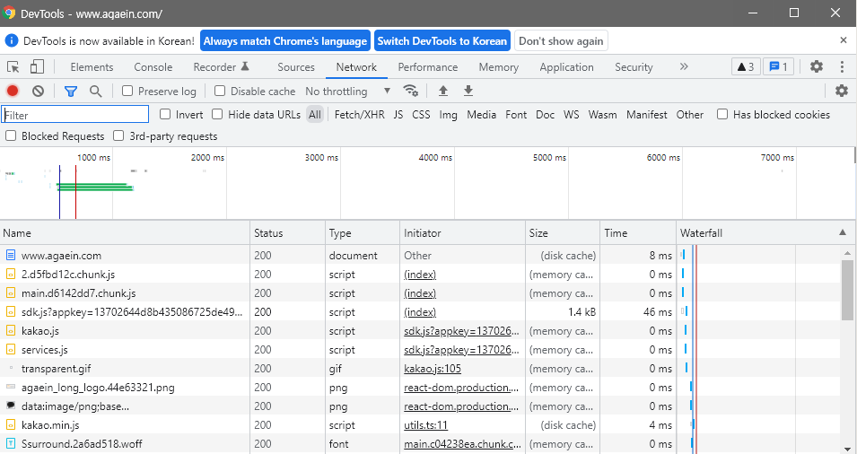
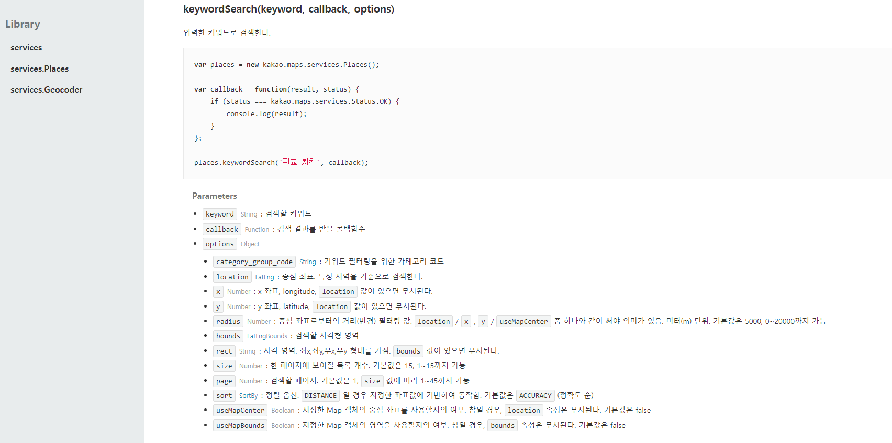
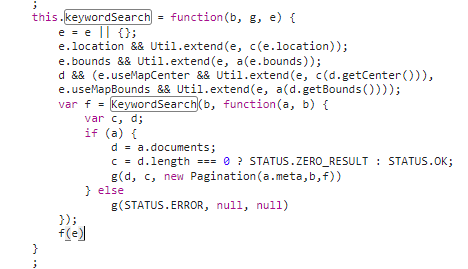
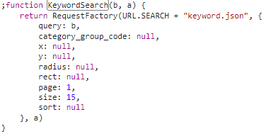
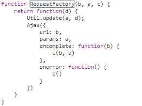
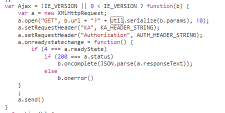

사이드 프로젝트를 진행하면서 카카오맵 API를 서버에서 사용해야하는 일이 생겼다. 그런데 지도 API다 보니까 실제로 보여주는 역할을 위주로 공식 문서가 작성되어 있었다.

<!--truncate-->

<br/>


<br/>

이렇게 공식 문서를 봐도 웹, 안드로이드, 애플을 지원하니까 JS, JAVA, SWIFT만 지원하게 되는데다가 Python Server를 사용할 예정이라 어떻게 지도 API를 사용할 수 있을까라고 계속 고민을 하게 되었고 마지막으로 생각해본 방식이

**🤔 '지도 자체를 불러오지 않고 서비스에 들어있는 API만을 사용할 방법이 없을까?'**

라는 생각이었다.

<br/>

## 🕵️‍♀️ 코드 뜯어보기

API만을 사용할 방법을 찾기 위해서는 구글 서치를 먼저 감행했지만 구글 서치로 나오는 글들은 카카오에서 제공하는 방법을 example화한 것들이 많았다. 그래서 그냥 코드를 뜯어보기로 했다. 카카오맵이라는게 사실상 CDN으로 JS파일들을 불러와서 우리가 API를 쏘는 형태라고 생각했기 때문이고, 코드를 뜯어보는 선택은 정말 좋은 선택이었던 것 같다.

일단 뜯어보는 과정을 말해보자면,

카카오맵은 script 삽입으로 카카오 지도를 가져오게 되는데, 카카오맵 API가 들어간 웹 상의 모든 서비스에는 밑과 같은 js 파일이 network 탭으로 날라오게 된다.

<br/>



<br/>

그러면 저기서 services.js와 kakao.js라는 js 파일이 보이게 된다.

여기서 어디로 들어가야할지는 공식 문서에서 어떤 API를 사용할 건지에 따라 다르다. 공식문서를 보면서 찾는 API가 kakao.js에 있을 것 같으면, kakao.js를 찾아보고 아니라면 services.js를 뜯어보면 된다.

나의 경우에는 쓸 API가 services API 쪽에 있는 키워드였다.

<br/>



<br/>

그렇기 때문에 딱봐도 services.js에 있을 거라 확신했고, services.js를 뜯어보았다. 해당 예측은 적중했고, 함수는 keywordSearch(keyword, callback, options)를 찾아, 해당 함수를 찾아서 쭉 들어가 이런 코드를 찾았다.

<br/>



<br/>

b라는 파라미터가 keyword라는 것을 확인하고, b가 어디에 쓰이는지 확인했다. 보면 파스칼케이스로 만들어진 같은 이름의 함수에 파라미터가 2개인 KeywordSearch(b, func)이 실행되고 있는 것을 확인 할 수 있다. 계속 뜯어보았다.


<br/>



<br/>

이제 뭔가 윤각이 보이기 시작했고, RequestFactory를 실행시키는 것을 확인할 수 있었다.

<br/>



<br/>

RequestFactory는 Ajax 요청을 했고 카카오는 Ajax라고 Ajax 요청 템플릿으로 만들어 놓은 것 을 볼 수 있었다.

<br/>



<br/>

드디어 어떤 API가 호출되는지 찾았고, 서버에 적용할 수 있었다. 밑에 URL.SEARCH와 Header 부분에 어떤 주소가 들어가는지 확인해서 정리해보았다.

<br/>


<br/>

## 📚 정리 및 서버에서 사용할 수 있는 API 예제

정리하면, 키워드로 지도 정보찾는 API는 밑과 같이 나온다.

* URL: http(s)://dapi.kakao.com/v2/local/search/keyword.json
* Param: ?query={keyword}&page=1&size=15
* Header:
```cookie
Content-Type=application/json;charset=UTF-8
Authorization=KakaoAK {web apiKey}
KA=sdk/v2 os/javascript lang/ko device/web origin/{origin 설정해놓은 값 아무 URL}
```

참고로 origin 설정 값은 kakao developers에서 origin으로 설정한 url 아무 값이나 넣어도 되었고, 이건 아마 카카오 맵쪽의 개발 오류인 것 같다. https://www.agaein.com 을 origin으로 설정해놓고 로컬에서 https://www.agaein.com 로 헤더에 origin URL 설정 후 날리면 성공하게 된다.

<br/>

:::note
연습코드는 밑의 curl에 {web apiKey}를 발급 받아넣고, origin 10개 설정하는 부분에 http://localhost:8080 를 추가한 다음 실행시키면 연습해볼 수 있다.

```bash
curl -X 'GET' \
  'http://dapi.kakao.com/v2/local/search/keyword.json?query=seoul&page=1&size=15' \
  -H 'Authorization: KakaoAK {web apiKey}' \
  -H 'KA: sdk/v2 os/javascript lang/ko device/web origin/http://localhost:8080' \
  -H 'Content-Type: application/json;charset=UTF-8'
```
:::

<br/>

이처럼 코드를 뜯어보면 카카오맵 API의 거의 모든 API를 서버에서 각 HTTP 요청으로 사용할 수 있을 것 같다. 이번엔 키워드 API에 그쳤지만, 다른 API를 사용해야 하는 상황이 온다면 좀 더 뜯어봐야겠다.

<br/>

## 🙇‍♂️ 느낀 점

사실 이 코드를 그냥 뜯어보라하면 이걸 왜 뜯어봐야 하지라는 생각을 들었을 것 같다. 근데 굳이 뜯어보고 서버에서도 카카오맵 API를 사용할 수 있게 만들어야 했던 건 사이드 프로젝트에 꼭 필요했던 기능이었기 때문이었다. 사이드 프로젝트 찬양론자처럼 보일 수도 있겠지만, **'역시 새롭게 뭔갈 해보는 것은 사이드 프로젝트가 제일이다'** 라는 생각이 더 깊이 박힌 것 같다.

<br/>