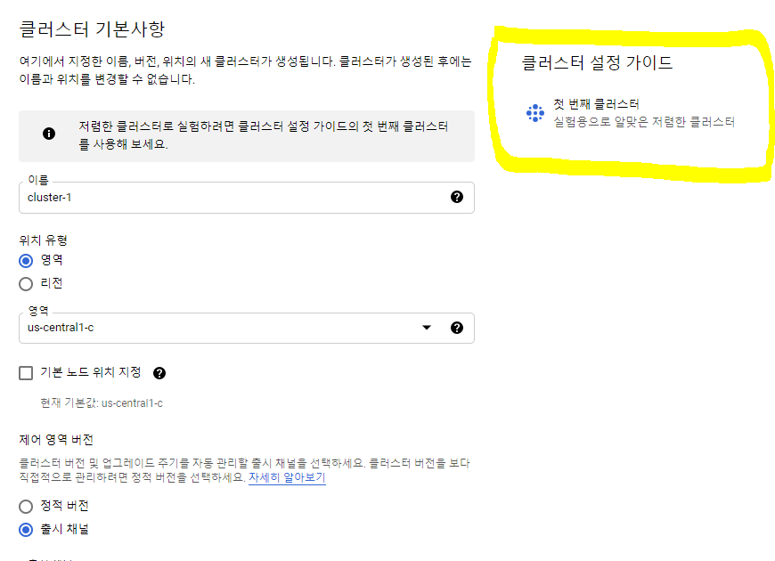
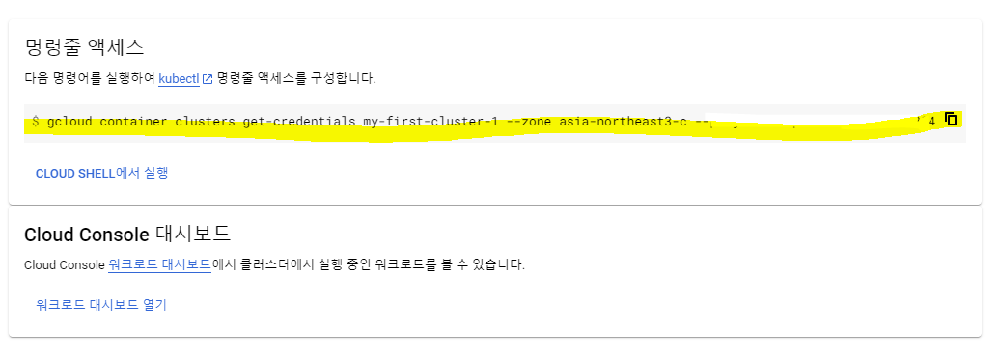

# GCP GKE 구축

## 클러스터 설정
1. 구글 클라우드 가입(첫 가입엔 무료 크레딧 $300를 준다.)
2. 클러스터로 들어간다.
  
  

3. 만들기를 누르면 표준모드와 Autopilot 모드 설정 가능 - 표준모드 선택
4. 오른쪽에 설정가이드에 첫 번째 클러스터라고 뜨는데 이걸 선택해준다.

  

:::info
* 영역이나 이름은 자신이 설정
* 영역은 asia-northeast3-a,b,c 3개 중 하나 추천(asia-northeast3가 한국지역)
:::

5. 윈도우용 sdk 설치 - https://cloud.google.com/sdk/docs/quickstart-windows
6. 설치완료 후 계정 / 프로젝트 / 서버지역 선택하는 것이 나온다 - 우리가 했던 설정을 기입하면 된다.
  - 계정과 서버지역은 알아서 입력하면 되는데, 프로젝트는 밑과 같이 들어가서 내 클러스터 프로젝트 ID를 확인

  

  

7. 이제 명령어창에서 명령어 입력
  ```bash
  # gcloud 업데이트
  gcloud components update
  # 확인 -  All components are up to date 나오면 정상
  gcloud components install kubectl
  ```

8. 내 클러스터와 연결

  * GCP의 클러스터에서 연결을 누르면 창이 뜬다.
  

  * 이거 복사해서 붙여넣기

  

  * 노드 확인 - `kubectl get nodes`

  

9. 대쉬보드 설치

* 쿠버네티스 자기꺼 무슨 버전인지 확인 후, 해당 url로 들어가서 맞는 버전확인 - https://github.com/kubernetes/dashboard/releases
* 1.20 버전은 대쉬보드 v2.2.0과 맞음

  ```bash
  # 대쉬보드 설치
  kubectl apply -f https://raw.githubusercontent.com/kubernetes/dashboard/v2.2.0/aio/deploy/recommended.yaml
  # 프록시 띄우기
  kubectl proxy
  ```

* 이젠 url로 접속가능 - http://localhost:8001/api/v1/namespaces/kubernetes-dashboard/services/https:kubernetes-dashboard:/proxy/

10. 사용자 권한 설정

* 여기서 사용자 권한을 설정할 수도 있고 아니면 그냥 권한 프리를 설정할 수 있다.
* 권한 프리 - 2버전 부터 사라짐
  ```bash
  kubectl -n kube-system edit deployments.apps kubernetes-dashboard
  ```
* 권한 설정
  * service-account.yml 작성
    ```yml
    apiVersion: v1
    kind: ServiceAccount
    metadata:
      name: admin-user
      namespace: kube-system
    ```
  * cluster-role-binding.yml 작성
    ```yml
    apiVersion: rbac.authorization.k8s.io/v1
    kind: ClusterRoleBinding
    metadata:
      name: admin-user
    roleRef:
      apiGroup: rbac.authorization.k8s.io
      kind: ClusterRole
      name: cluster-admin
    subjects:
      - kind: ServiceAccount
        name: admin-user
        namespace: kube-system
    ```
  * 명령어 입력
    ```bash
    # 생성 및 권한 부여
    kubectl create -f service-account.yml
    kubectl create -f cluster-role-binding.yml
    # 유저 확인
    kubectl get sa -n kube-system
    # 계정 토큰 조회 / 해당 경로에서 bash로 켜야 작동함
    kubectl -n kube-system describe secret $(kubectl -n kube-system get secret | grep admin-user | awk '{print $1}')
    ```
  * 토큰으로 대쉬보드 접근 가능

:::info
**프로젝트 변경 방법**
```bash
# 프로젝트 리스트 확인
gcloud projects list
# 프로젝트로 변경
gcloud config set project [PROJECT_ID]
# 프로젝트 앱 확인 가능
gcloud app describe
```
:::

<br/>

## 클러스터 구축

1. 파드나 서비스, 컨트롤러 등을 만들 때 여길 누른다.

  

2. 구축 전 hostpath로 폴더 생성
```yml
apiVersion: v1
kind: Pod
metadata:
  name: pod-volume-3
spec:
  nodeSelector:
    kubernetes.io/hostname: gke-cluster-2-default-pool-8e36e070-qgs4
  containers:
  - name: container
    image: kubetm/init
    volumeMounts:
    - name: host-path
      mountPath: /mount1
  volumes:
  - name : host-path
    hostPath:
      path: /var/videos
      type: DirectoryOrCreate
```

3. 퍼시던트 볼륨 구축
```yml
apiVersion: v1
kind: PersistentVolume
metadata:
  name: pv-01
spec:
  capacity:
    storage: 30G
  accessModes:
  - ReadWriteOnce
  local:
    path: /var/videos
  nodeAffinity:
    required:
      nodeSelectorTerms:
      - matchExpressions:
        - {key: kubernetes.io/hostname, operator: In, values: [gke-cluster-2-default-pool-8e36e070-qgs4]}
```

4.퍼시던트 클레임 볼륨 구축
```yml
apiVersion: v1
kind: PersistentVolumeClaim
metadata:
  name: pvc-01
spec:
  accessModes:
  - ReadWriteOnce
  resources:
    requests:
      storage: 30G
  storageClassName: ""
```

5. 파즈 생성
```yml
apiVersion: v1
kind: Pod
metadata:
  name: video-server-1
  labels:
    app: video
spec:
  containers:
  - name: container
    image: fksk94/video
    volumeMounts:
    - name: pvc-pv
      mountPath: /videos
  volumes:
  - name : pvc-pv
    persistentVolumeClaim:
      claimName: pvc-01
```
6. 서비스 생성 - 로드 밸런서
```yml
apiVersion: v1
kind: Service
metadata:
  name: svc
spec:
  selector:
    app: video
  ports:
  - port: 80
    targetPort: 8002
  type: LoadBalancer
```
```yml
apiVersion: v1
kind: Service
metadata:
  name: svc
spec:
  selector:
    app: video
  ports:
  - name: http
    protocol: TCP
    port: 80
    targetPort: 80
  - name: https
    protocol: TCP
    port: 443
    targetPort: 443
  - name: vvs
    protocol: TCP
    port: 8002
    targetPort: 8002
  type: LoadBalancer
```

7. 볼륨 2개 02, 03으로 더 생성 후, 클레임 02, 03 생성해서 연결
8. 이제 파즈 더 생성
```yml
apiVersion: v1
kind: Pod
metadata:
  name: video-server-2
  labels:
    app: video
spec:
  containers:
  - name: container
    image: fksk94/crvideo
    volumeMounts:
    - name: pvc-pv
      mountPath: /videos
  volumes:
  - name : pvc-pv
    persistentVolumeClaim:
      claimName: pvc-02
```
```yml
apiVersion: v1
kind: Pod
metadata:
  name: video-server-3
  labels:
    app: video
spec:
  nodeSelector:
    kubernetes.io/hostname: gke-cluster-1-default-pool-3b9e77f7-q3kj
  containers:
  - name: container
    image: fksk94/crvideo
    volumeMounts:
    - name: pvc-pv
      mountPath: /videos
  volumes:
  - name : pvc-pv
    persistentVolumeClaim:
      claimName: pvc-03
```
9. 이러면 구축이 끝나고 쿠버네티스를 사용하면 된다.

## 도커 허브 이미지 만들기

위에서 가져오는 이미지는 도커허브를 이용해서 가져오므로 도커허브에 이미지를 넣어둔다.

1. 도커 허브 회원가입
2. 도커 허브 레파지토리 생성
3. 도커 허브에 이미지 올리기
```bash
docker tag videotest:latest fksk94/videotest:latest
docker push fksk94/videotest:latest
```

## HTTPS 설정
1. 일단 서비스 주소 확인
```yml
status:
  loadBalancer:
    ingress:
      - ip: 34.64.217.188
```
2. 타겟 포트 80, 443 포트 준비
```yml
spec:
  ports:
    - protocol: TCP
      port: 80
      targetPort: 80
      nodePort: 31932
```
3. 인증서 받기
```bash
#letsencrypt로 받는데 이런게 뜰 수 있다.
challenge ~~~~~ 
http://www.coderun.shop/.well-known/acme-challenge/fWcK2kE4GJyuHLznSYLIpckbtuUa7EDyuXPCpU--EuA

# 그럼 해당 명령어 후 나오는 텍스트를 복사한다.
certbot certonly -d www.coderun.shop --manual --preferred-challenges dns
```
* 나온 텍스트로 밑처럼 설정하면 된다. (가비아 예시)


4. 확인
```bash
# 다른 배쉬창에서
nslookup -q=TXT _acme-challenge.www.coderun.shop
# 확인 후, 진행 창에서 엔터 그러면 풀체인과 프라이빗키가 생기고 이걸 설정해주면 됨.
# 이후 nginx 재기동
service nginx restart
```

<br/>
