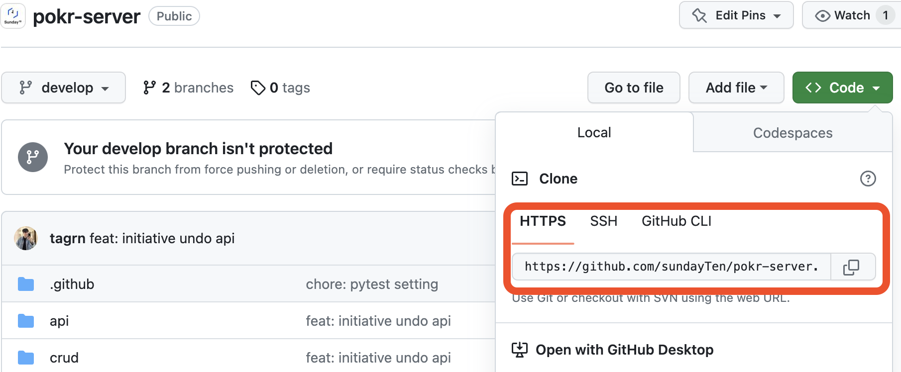

# Git

:::info
Git은 분산버전관리시스템(DVCS-Distributed Version Control System)이다. 소스코드의 버전 및 이력을 관리할 수 있다.
:::

## 준비

윈도우에는 git을 활용하기 위해서 [홈페이지](https://git-scm.com/download/win)에서 git을 설치한다. 그 후, [git bash](http://https://gitforwindows.org/)를 설치해서 보다 편하게 사용한다.

맥에서는 터미널에서 `brew install git`만 입력하면 된다.

**초기 설치**를 완료한 이후에 컴퓨터에 `author`정보를 입력한다.

```bash
git config --global user.name {user name}
git config --global user.email {user email}
```

<br />

## Git 사이클


:::note
대부분 밑과 같은 순서로 진행된다.

Working Directory -> `add` -> Stage Area -> `commit` -> Local Repository -> `push` -> Remote Repository
:::

<br />

## 기초 활용법

### 1. 저장소 초기화

```bash
git init
```

- `.git`폴더가 생성되며, 여기에 git과 관련된 모든 정보가 저장된다.
- 첫 git branch는 main이라고 표시가 된다.

<br />

### 2. add

Working Directory(작업공간)의 변경된 사항을 Staging Area에 올린다.

```bash
git add git_정리.md # 특정 파일
git add aws/ # 특정 폴더
git add . # 현재 디렉토리의 모든 파일
```

<br />

### 3. Commit

- 버전의 이력을 확정짓는 명령어, 해당 시점을 스냅샷으로 만들어서 기록을 한다.
- 커밋시에는 반드시 log 메세지를 작성해야하며, log 메세지는 변경사항을 알 수 있도록 명확하게 작성해주면 된다.

```bash
git commit -m '깃 정리 문서 작성'
```

<br />

### 4. 원격 저장소 준비

GitHub나 GitLab 등에서 새로운 레파지토리를 만든다.

<br />

### 5. 원격 저장소를 로컬에 등록

```bash
git remote add origin {remote repository address}
git remote -v # 현재 등록된 remote 정보를 확인 가능.
```

#### Remote Repository Address 보는 법



<br />

### 6. Push

- 원격 저장소로 업로드

```bash
git push origin main
```

<br />

## 명령어 종류

### `git init`

- 현재 폴더에서 git 명령어를 쓸 수 있게 해준다.
- .git 파일이 생기고 이 파일에 지금부터 쓰는 git 명령어들과 history가 저장된다.

### `git log`

- 현재 repository의 history를 보여준다.
- `git log -p`는 변경된 history의 내용을 보여준다.
  - 이 명령어를 통해 각 커밋의 해시 값을 알 수 있다.
  - 그 해시 값을 통해 각 커밋 버전으로 돌아갈 수 있다.
- `git log --oneline`로 로그 한 줄씩 볼 수 있다.

### `git diff`

- 마지막 버전과 변경된 파일의 차이점을 보여준다.

### `git status`

- Working Tree의 상태를 보여준다.

### `git add`

- 현재 폴더의 모든 파일을 staging area로 올려준다.
- `.` 대신 각각의 파일을 지정해줘도 된다.
- 예를 들면, `git add hello.txt`

### `git commit`

- 버전을 만든다.
- repository에 저장된다.
  - 저장된다고 해서 원격과 동기화가 되는 것은 아니다.
  - repository에 저장된 데이터는 `push`로 원격 git과 동기화 시켜줘야 한다.
- `git commit -m "message"` 는 우리가 커밋할 때, 쓸 메세지를 쓸 수 있게 만든다.
- `git commit -a -m "message"`
  - 옵션 `-a`를 추가하면 새로만든 파일이 아닌 기존파일에서 변경된 부분을 add와 함께 commit한다.
- `git commit --amend -m "new message"`를 통해 최근 커밋 로그를 바꿀 수 있다.

### `git push`

- 원격 git과 동기화 시킨다.
- 현재 로컬 git에서 수정한 파일들을 원격 git으로 올리는 것이다.
- `git push origin main` 이렇게 하면 main 브랜치로 올릴 수 있다.
- `git push -u origin main`
  - 이렇게 하면 다음부터 `git push`만 써도 `git push origin main`가 실행된다.

### `git branch`

- `git branch`만 하면 현재 있는 브랜치들의 목록이 뜬다.
- `git branch {생성할 브랜치}` - 브랜치 생성
- `git branch -D {삭제할 브랜치}` - 브랜치 제거

### `git pull`

- push와 반대라고 생각하면 된다.
- 현재 로컬 레파지토리에서 원격 레파지토리에 업데이트 된 것을 업데이트할 때 사용한다.
  - 협업 시에 꼭 필요한 존재이다.
- pull이 되지 않을 시 : `git pull origin main --allow-unrelated-histories`

### `git checkout`

- 브랜치 이동에 쓰인다.
- 새로운 브랜치를 만들면서 이동할 땐, `git checkout -b {생성할 브랜치}`로 이동한다.

### `git reset`

- 이전 커밋으로 되돌리는 명령어이다.
- `git reset HEAD^1` - 마지막 버전으로 working tree를 돌린다.
- `--hard` 옵션을 주게 되면 변경사항들이 Working Directory에서도 사라진다.
- 이걸 로컬에서 바꾼다음, 원격으로 올릴 때 얽히는 문제가 발생한다.
  - 그렇기 때문에 `git push origin {branch} -f`를 통해 원결 레파지토리 커밋을 지울 수 있다.
  - 하지만 이건 잘못하면 예전 코드가 다 사라지는 불상사가 발생할 수 있기에 조심해야 한다.

### `git revert`

- 이전 커밋으로 되돌리는데, reset과 다르게 새로운 커밋을 생성하며 이전 버전으로 되돌린다.
  - 즉, 이전 커밋이 남아 있는 채로 코드만 이전 버전으로 돌아가는 것이다.

:::info
git revert, git reset, git restore의 차이 - [공식문서](https://git-scm.com/docs/git#_reset_restore_and_revert) 참고
:::

<br />
