# S3 정적 웹사이트 자동배포

## GitHub Actions Workflow 파일작성

먼저 자동 배포할 GitHub 레파지토리를 준비한다. 해당 레파지토리에서 `.github/workflows/{원하는 이름}.yml` 파일을 만든다. 이렇게 폴더와 파일을 만들면 GitHub에서 `.gitignore` 와 같이 `.github` 폴더를 인식한다. workflows 폴더 안의 파일들은 GitHub Actions 에서 돌아가게 되고 이 방식을 통해 자동배포를 설정할 수 있다. 파일에 대한 예시는 밑에서 볼 수 있다.

**deploy-S3.yml**

```yml
name: deploy S3 # Workflow 이름

on:
  push:
    branch: main # 원하는 브랜치 설정

env:
  NODE_VERSION: 18.x # Node 버전 설정
  INSTALL_COMMAND: yarn install # npm이면 npm install
  BUILD_COMMAND: yarn build # npm이면 npm run build
  AWS_REGION: ap-northeast-2 # 한국이면 ap-northeast-2 아니라면 AWS에서 확인
  AWS_S3_BUCKET: bucketname # S3 버킷 네임

###### 위만 알맞게 변경 ######

jobs:
  build-and-deploy:
    runs-on: ubuntu-latest
    steps:
      - name: git clone
        uses: actions/checkout@v3
      - name: set node version
        uses: actions/setup-node@v3
        with:
          node-version: ${{ env.NODE_VERSION }}
      - name: dependency install
        run: ${{ env.INSTALL_COMMAND }}
      - name: build
        run: ${{ env.BUILD_COMMAND }}
      - name: deploy
        env:
          AWS_ACCESS_KEY_ID: ${{ secrets.S3_ACCESS_KEY_ID }}
          AWS_SECRET_ACCESS_KEY: ${{ secrets.S3_SECRET_ACCESS_KEY }}
        run: aws s3 cp --recursive --region ${{ env.AWS_REGION }} build s3://${{ env.AWS_S3_BUCKET }}
```

:::tip
`jobs`에서 나중에 변경될만한 것들은 `env`로 빼두고 사용하면 재사용하기 쉽다.
:::

### 워크플로우 요약

1. 코드를 레파지토리에 푸시한다.
2. 푸시를 캐치하여 작업물을 빌드한다.
3. 빌드한 결과물을 S3에 올린다.

<br />

## AWS IAM 설정

자, GitHub Actions 파일설정은 모두 끝났다. 하지만 이렇게 파일을 올리면 `deploy` 부분이 동작하지 않는다. 그렇기 때문에 동작하지 않는 코드에 대한 설정을 해줘야 한다.

**동작하지 않는 부분**

```yml
- name: deploy
  env:
    AWS_ACCESS_KEY_ID: ${{ secrets.S3_ACCESS_KEY_ID }}
    AWS_SECRET_ACCESS_KEY: ${{ secrets.S3_SECRET_ACCESS_KEY }}
  run: aws s3 cp --recursive --region ${{ env.AWS_REGION }} build s3://${{ env.AWS_S3_BUCKET }}
```

<br />

### IAM 사용자 생성

먼저 밑 부분은 IAM 설정과 관련이 있다. S3를 쓸 수 있는 계정을 AWS 에서 만들어 주어야 한다.

```
AWS_ACCESS_KEY_ID: ${{ secrets.S3_ACCESS_KEY_ID }}
AWS_SECRET_ACCESS_KEY: ${{ secrets.S3_SECRET_ACCESS_KEY }}
```

<br />

**1. AWS Web Console에 접속 후, IAM 이라는 서비스로 들어간다.**

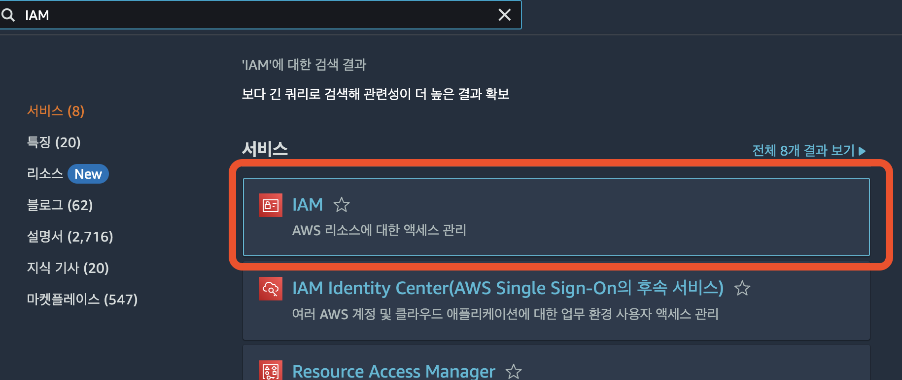

<br />

**2. 왼쪽 탭에서 사용자를 선택하고 새로운 사용자를 만든다.**


<br />

**3. 원하는 이름을 설정한다. 이 때, 나중에 어떤 곳에 쓰이고 있는지 알 수 있는 이름으로 설정해주면 좋다.**

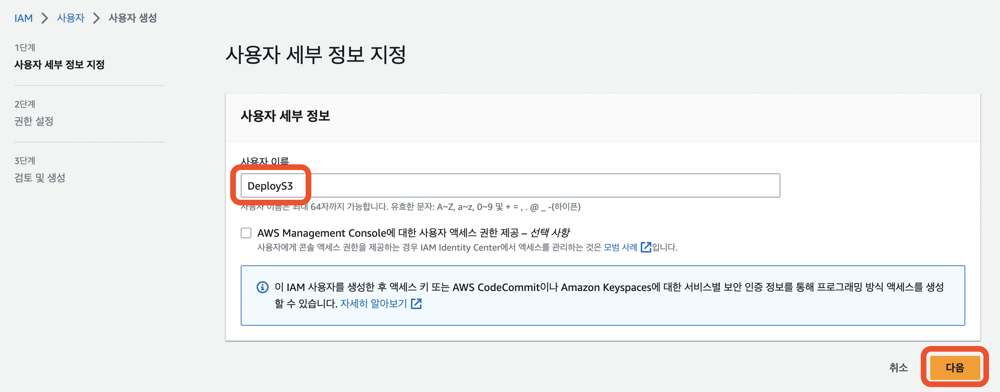

<br />

**4. 직접 정책 연결을 선택 후, 원하는 권한을 부여한다. `AmazonS3FullAcees` 권한은 S3에 접근할 수 있는 모든권한을 뜻한다. 권한을 설정 했다면 다음으로 눌러 검토 및 생성 단계로 넘어간다.**

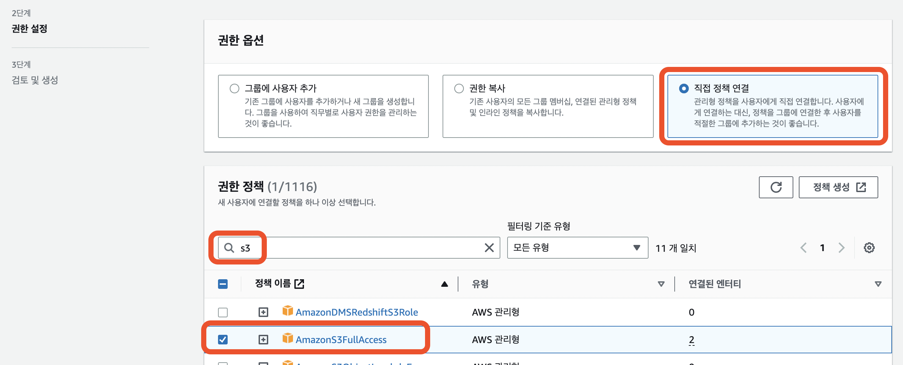

<br />

**5. 앞에서 잘 설정했다면 문제없이 사용자 생성을 누르면 된다.**

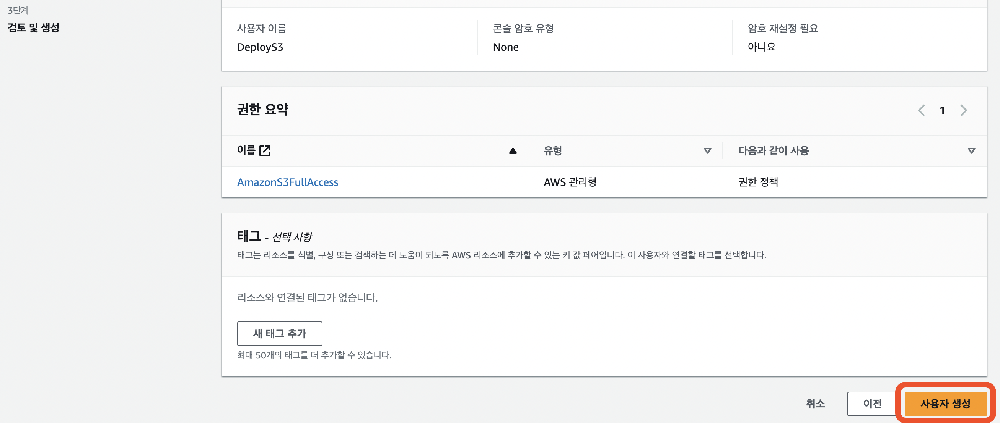

<br />

### IAM Access Key 획득

이제 생성한 사용자를 GitHub Actions 에서 쓸 수 있도록 Access Key 를 얻을 것이다.

<br />

**1. 만들어진 사용자의 정보를 클릭하면 "보안 자격 증명"이라는 탭을 볼 수 있다.**


<br />

**2. 해당 탭의 밑에는 **액세스 키**라는 탭이 있다. 만들기를 눌러 진행한다.**


<br />

**3. 사용 사례를 정하는데, 우리는 외부 GitHub Actions 에서 쓸거니 밑과 같이 선택한다.**

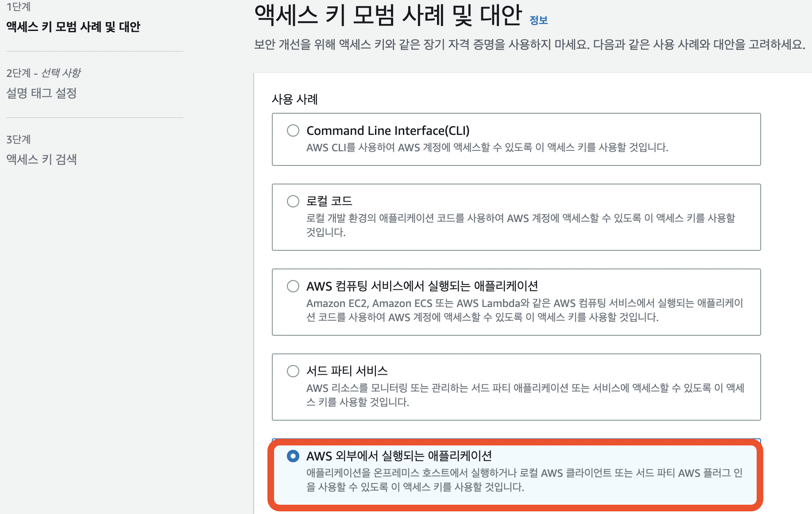

<br />

**4. 설명은 선택사항이지만 나중에 관리하기 쉽도록 하나 적어준다.**


<br />

**5. 만들어진 키는 이렇게 나오는데, 만들 때 한 번 밖에 보지 못 한다. 그러니 액세스 키와 비밀 액세스 키를 모두 안전한 곳에 잠시 보관하자.**


<br />

## Access Key를 GitHub Secrets에 설정

IAM 사용자에서 Access Key를 얻었다면 이제 밑의 부분을 설정할 수 있게 되었다. 해당 키들을 `secrets`로 만들고 workflow에서 활용할 수 있게 된다.

```yml
AWS_ACCESS_KEY_ID: ${{ secrets.S3_ACCESS_KEY_ID }}
AWS_SECRET_ACCESS_KEY: ${{ secrets.S3_SECRET_ACCESS_KEY }}
```

이 키들을 `secrets`로 활용하기 위해선 GitHub 페이지에서 설정을 해주어야 한다.

<br />

**1. 레파지토리에서 "Setting"으로 들어간다.**


<br />

**2. 왼쪽 탭에서 "Secrets and variables -> Actions"로 들어가 레파지토리의 비밀 키를 만든다.**

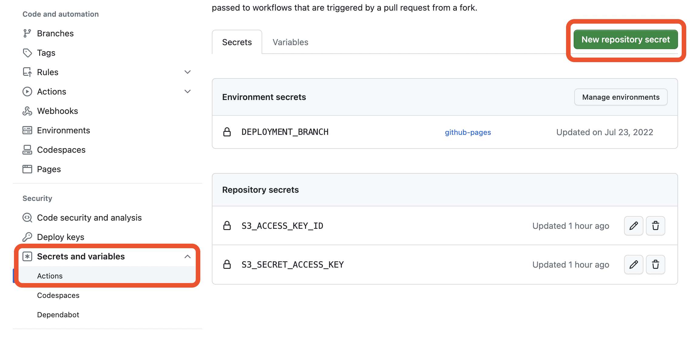

<br />

**3. Name에는 원하는 키 이름. 그리고 Secret에는 방금 전 복사해둔 키를 입력한다.**

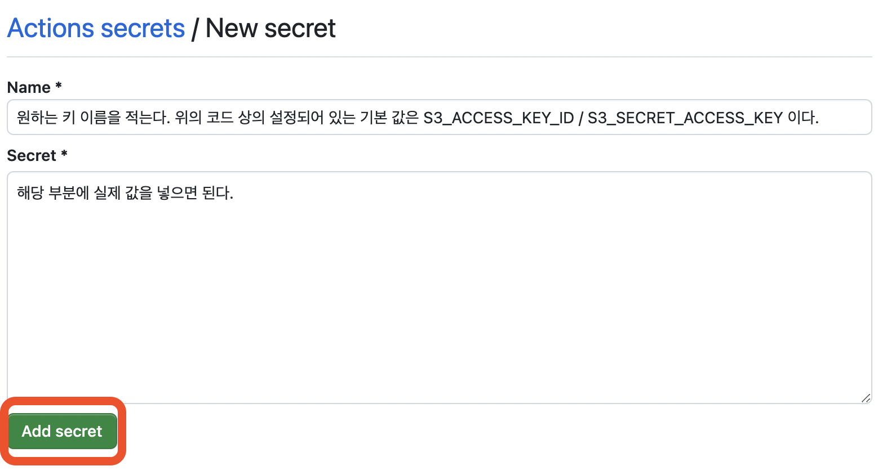

이렇게 설정하면 `secrets`를 workflow에서 활용할 수 있게 된다.

<br />

## S3 버킷 생성

동작하지 않았던 코드 중 마지막 코드인 밑의 코드만 이제 동작하게 만들면 된다.

```yml
run: aws s3 cp --recursive --region ${{ env.AWS_REGION }} build s3://${{ env.AWS_S3_BUCKET }}
```

이 코드가 동작하지 않는 이유는 우리가 S3 버킷에 대한 권한을 주었다고 하더라도 S3 버킷을 만들지 않은 상태라는 것이다. 이제 S3를 만들어서 자동 배포를 완벽하게 해보자.

<br />

**1. AWS Web Console 에서 S3로 들어간다.**

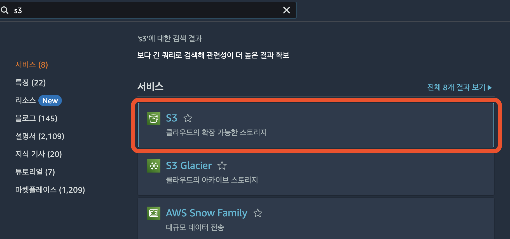

<br />

**2. S3 버킷을 생성한다.**

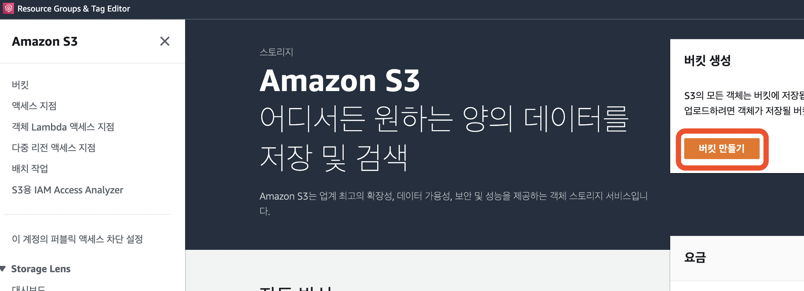

<br />

**3. 버킷에 대한 이름을 작성하고 리전을 선택한다. 해당 버킷 이름은 제일 위 `workflow` 코드에서 `env.AWS_S3_BUCKET` 에 써야한다. (서울리전이 아니라면 리전도 마찬가지로 다른 리전을 선택하고 코드를 바꿔준다.)**

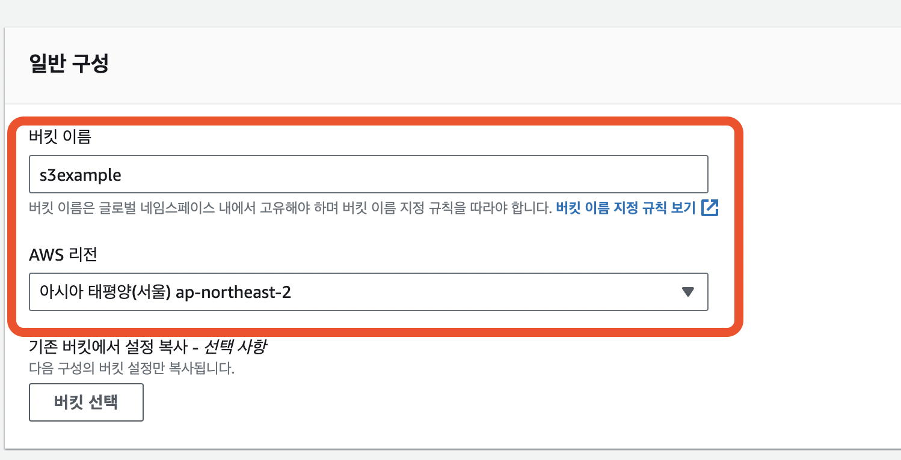

<br />

**4. S3로 정적 웹사이트를 만들 것이기 때문에 `public access` 를 허용해주어야 한다. 그리고 생성을 누른다.**

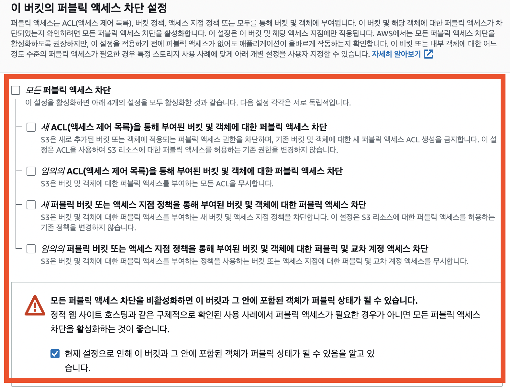

<br />

**5. 이렇게 만들어진 S3에서 한 번 더 버킷 정책 권한을 설정 해주어야 한다. 권한을 들어간다.**


<br />

**6. 권한을 들어가서 스크롤을 내려보면 버킷 정책이라는 곳이 보일거고 해당 정책에 밑의 코드를 써 넣어 준다. `{버킷 이름}` 부분에는 방금 전 만들었던 버킷이름을 써줘야 한다. `arn:aws:s3:::s3example/*` 식으로 말이다.**

```json
{
  "Version": "2012-10-17",
  "Statement": [
    {
      "Sid": "PublicRead",
      "Effect": "Allow",
      "Principal": "*",
      "Action": "s3:GetObject",
      "Resource": "arn:aws:s3:::{버킷 이름}/*"
    }
  ]
}
```

<br />

**7. 속성으로 들어간다. 여기를 들어가는 이유는 정적 웹 호스팅 설정을 하기 위함이다.**


<br />

**8. 맨 밑으로 내리면 정적 호스팅에 대한 설정이 나온다.**


<br />

**9. 편집을 누르고 들어가서 정적 웹 사이트 호스팅 활성화를 누르고 인덱스 문서에는 `index.html` 을 설정해 준다. 왠만하면 `index.html` 이긴 한데, 독특한 프레임워크라면 다를 수도 있으니 빌드되는 파일을 한 번 확인해보길 권장한다.**

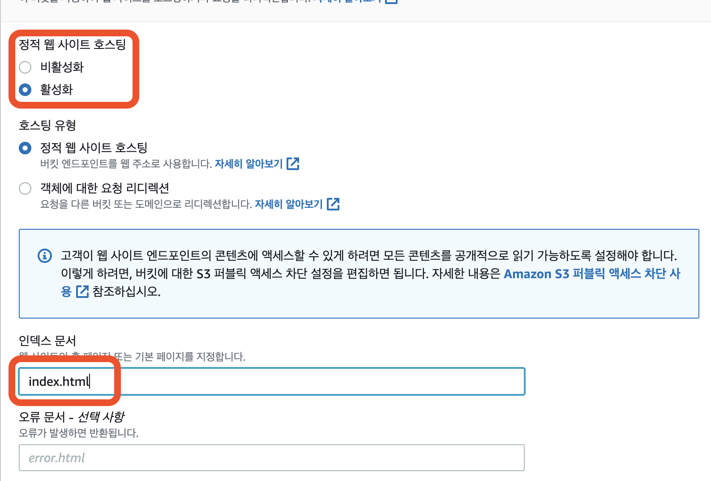

<br />

**10. 이렇게 설정이 끝나고 나면 정적 웹 사이트 호스팅이 완성되고, 밑에 엔드포인트가 생성된다.**


<br />

## 끝으로

이제 코드를 지정한 브랜치에 푸시한 후, `workflow`가 모두 돌아가면 엔드포인트에서 내 결과물을 확인할 수 있다.

<br />
